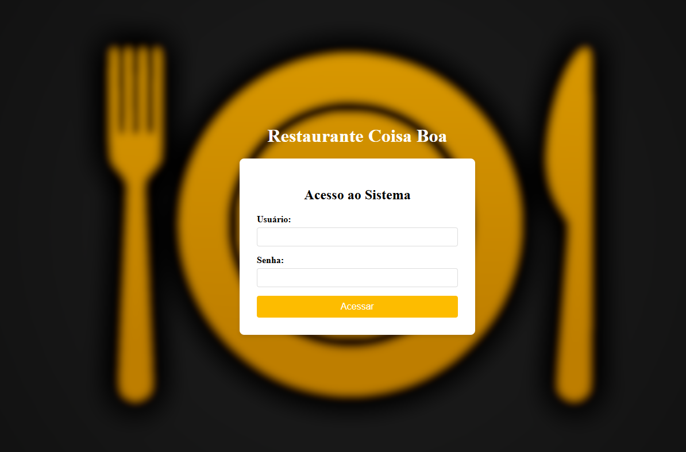
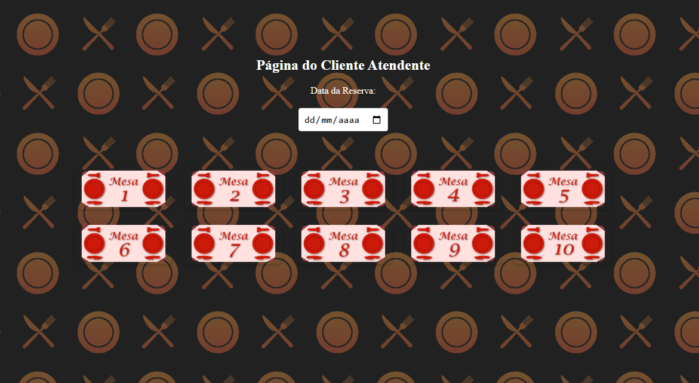
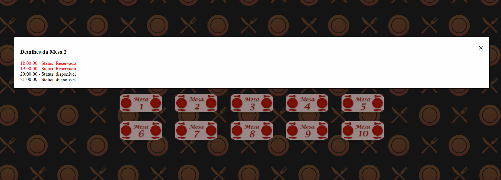
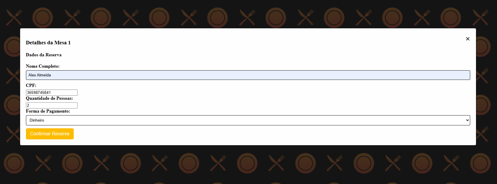
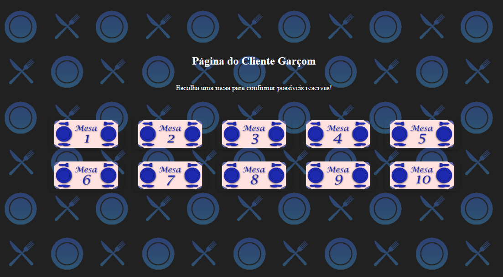
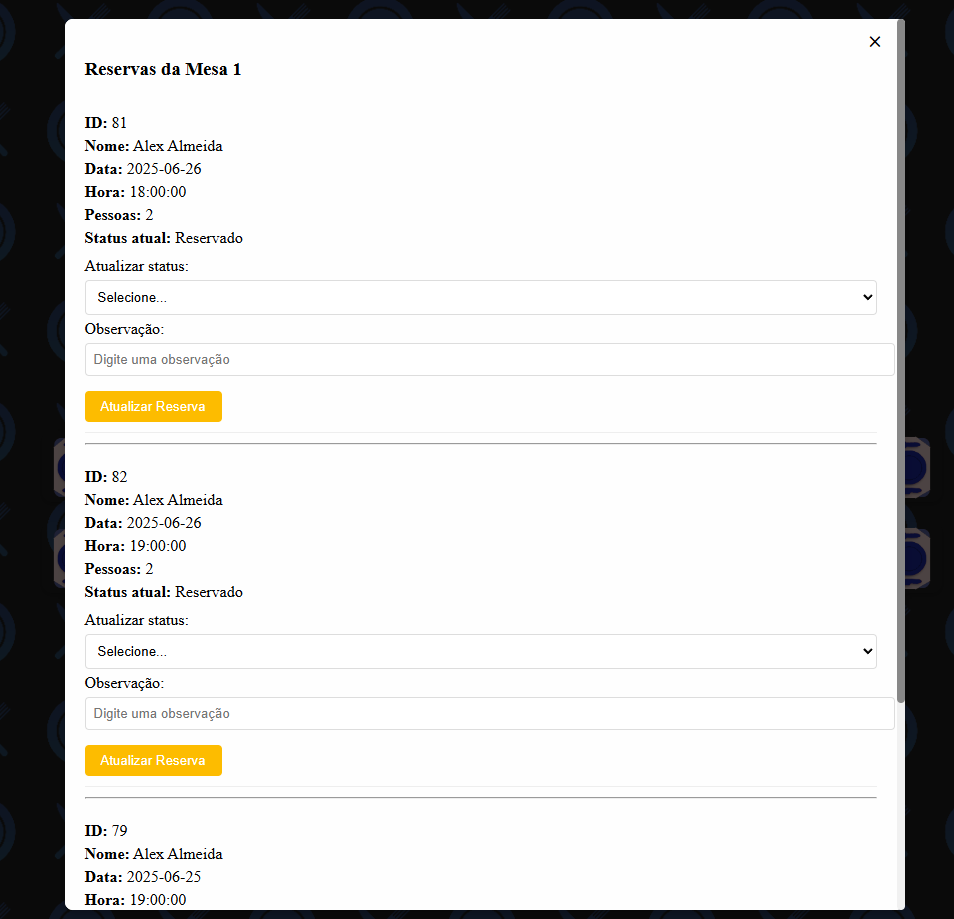
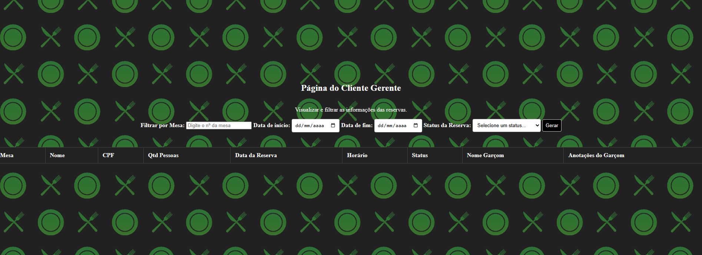
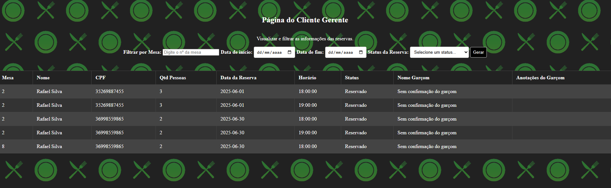

# Restaurante Coisa Boa

## -> Tela de login

## -> Telas do Atendente

--- Tela de horários disponíveis

--- Tela de agendamento de reserva

--- Tela de cancelamento de reserva

## -> Telas do Garçom

--- Tela de horários disponíveis para confirmar

-> Telas do gerente

--- Mostrando relatório

> Contexto

Projeto de finalização do semestre, um site que registra reservas ou cancela em um banco de dados pelo atendente,  atualiza seu estado como "confirmada" ou "Não confirmada" pelo garçom e gera relatórios pelo gerente baseado nos filtros possíveis.

## Tecnologias
- Javascript
- Node
- Express
- Supabase
- Exceljs
- HTML5
- CSS3
- Git e Github

## Participantes
Rafael Rangel - rafael.profissional011@gmail.com
Davi Floriano
Paulo 
Victor Botto
Eduardo
