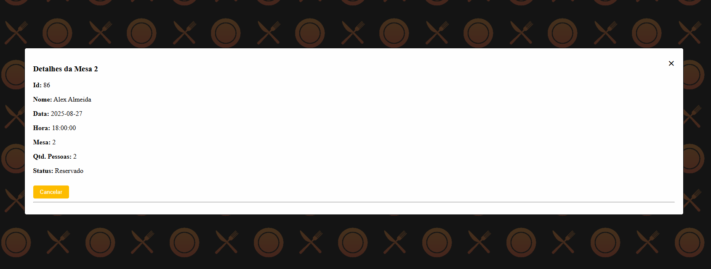

# Restaurante Coisa Boa

## -> Tela de login


## -> Telas do Atendente


--- Tela de horários disponíveis


--- Tela de agendamento de reserva


--- Tela de cancelamento de reserva


## -> Telas do Garçom


--- Tela de horários disponíveis para confirmar


-> Telas do gerente


--- Mostrando relatório


> Contexto

Projeto de finalização do semestre, um site que registra reservas ou cancela em um banco de dados pelo atendente,  atualiza seu estado como "confirmada" ou "Não confirmada" pelo garçom e gera relatórios pelo gerente baseado nos filtros possíveis.

## Tecnologias
- Javascript
- Node
- Express
- Supabase
- Exceljs
- HTML5
- CSS3
- Git e Github

## Intalação

1. Clone o repositório:
```bash
git clone https://github.com/A3-sistemas-distribuidos/site.git
```

2. instale as dependências:
```bash
npm install
```

3. Rode o projeto:
```bash
node server.js
```

> Dados para login:

Atendente  
login: Adriana  
senha: senhaatendente  
|  
login: Silas  
senha: senhaatendente  
|  
login: Bianca  
senha: senhaatendente  
-=-=-=-=-=-=-=-=  
Garçom  
login: Lucas  
senha: senhagarcom  
|  
login: Adrian  
senha: senhagarcom  
|  
login: Eliane  
senha: senhagarcom  
-=-=-=-=-=-=-=-=  
Gerente  
login: Gilberto  
senha: senhagerente     

## Uso do Sistema  

- Para uso das funções do atendente:  
1. Coloque a data da reserva que deseja inserir ou cancelar.  
2. Escolha um horário disponível para adicionar a reserva (clicando em cima do horário com letras pretas) ou para cancelar a reserva (clicando em cima do horário com letras vermelhas).  
3. Para criar uma reserva clique em um horário disponível e digite as informações pedidas, e então clique em confirmar reserva.  
4. Para cancelar uma reserva clique em um horário com status “Reservado”, após isso clique em cancelar.  

- Para uso das funções do garçom:  
1. Clique na numeração da mesa que quer confirmar a reserva.  
2. Atualize seu status para “Reserva Confirmada” para caso o cliente tenha confirmado, ou “Reserva não Confirmada” para caso da ausência do cliente.  
3. coloque uma observação pertinente caso seja necessário.  
5. clique em atualizar reserva.  

- Para uso das funções do gerente:  
1. Digite o número da mesa e clique em gerar para pegar todas as estatísticas daquela mesa.  
2. Selecione uma data de início para caso queira as informações de uma data específica.  
3. Selecione uma data de fim para caso queira estabelecer um intervalo de tempo.
4. Digite o nome de um garçom para ver todas as mesas relacionadas a ele.
5. Selecione um status da reserva para ver as reservas que foram canceladas, confirmadas, não confirmadas ou que ainda estão em status de aguardo, reservado.  


## Participantes
-Davi Floriano  - daviflorianohermida@gmail.com  
-Eduardo  Estreça - eduardoestrela14@gmail.com  
-Eraldino Lopes - eraldinoneto@gmail.com  
-Paulo Victor -  pvjesus57@gmail.com  
-Rafael Rangel - rafael.profissional011@gmail.com  
-Victor Botto  -  victorbotto2004@gmail.com  
